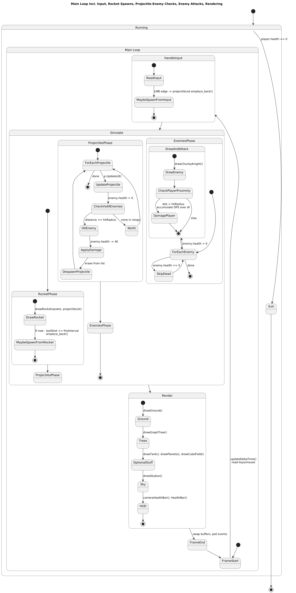
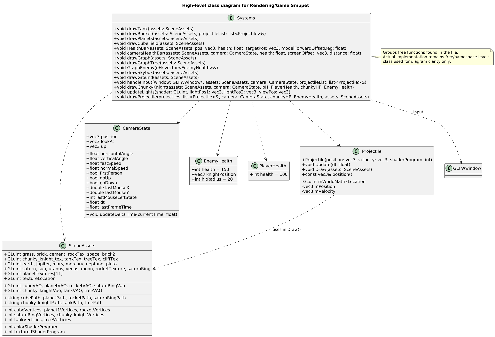

# Chunky-Knights-Blast-Off

An arid battlefield adventure game where you navigate terrain, evade chunky knights, and engage in dynamic combat using a plane and tank. Utilizes real-time rendering and dynamic physics for immersive gameplay.

## Controls

**Camera Movement**

- `W/A/S/D`: Move forward / left / backward / right
- `Space`: Move up
- `Left Shift`: Move down
- `Mouse`: Look around
- `1`: Switch to First-Person Camera
- `2`: Switch to Third-Person Camera
- `E`: assend on the z axis
- `Q`: desend on the z axis

**Other**
- Esc: Exit program

## Features

- Free-look camera with mouse and keyboard controls
- Camera-relative movement
- Toggle between first-person and third-person views
- Textured 3D models including knights, tank, plane, and terrain
- Dynamic lighting with orbiting point lights
- Custom OBJ models and textures

## Project Structure

Chunky-Knights-Blast-Off/
```
├── Project_2
│   ├── Export_OBJ.py
│   ├── Models/
│   │   ├── Plane.obj
│   │   ├── Planet.obj
│   │   ├── chunky_knight.obj
│   │   ├── cube.obj
│   │   ├── grass.obj
│   │   ├── rocket.obj
│   │   ├── saturn_ring.obj
│   │   ├── tank.obj
│   │   └── tree.obj
│   ├── OBJloader.h
│   ├── OBJloaderV2.h
│   ├── Shaders/
│   │   ├── FragmentShaderSource.glsl
│   │   └── vertexShaderSource.glsl
│   ├── Textures/
│   │   ├── Bricks060_1K-JPG_Color.jpg
│   │   ├── Grass001_1K-JPG_Color.jpg
│   │   ├── Plane.png
│   │   ├── Rock058_1K-JPG_Color.jpg
│   │   ├── Tank.png
│   │   ├── chunky_knight_tex.png
│   │   └── tree.png
│   ├── graph.h
│   ├── graphNode.h
│   ├── main
│   ├── project.cpp
│   ├── stateDiagram.txt
│   └── Preview.png
├── README.md
└── include/
    └── stb/
        └── stb_image.h
```

## Example & Documentation






## Build Instructions

### Linux/macOS/wsl               

```bash
export LIBGL_ALWAYS_SOFTWARE=1
g++ -o MyApp main.cpp -I../include -L/usr/lib -lGLEW -lGL -lglfw -lm
./MyApp
```

### Windows

```bash
g++ src/*.cpp -o SolarSystem.exe -lglew32 -lglfw3 -lopengl32 -lgdi32
main.exe
```


## Dependencies

- OpenGL
- GLFW
- GLM
- GLEW (or GLAD)
- stb_image.h
- OBJloader (custom)

## Resources

- NASA textures: https://planetpixelemporium.com/mercury.html
- Rocket model: https://sketchfab.com/3d-models/space-craft-f7026b90bf9b44c99c15f7afc87bcdd3
- Additional textures: https://ambientcg.com/
- Default sphere exported from Blender with triangulate modifier

## License

This project is licensed under the MIT License - see the [LICENSE](LICENSE) file for details.
